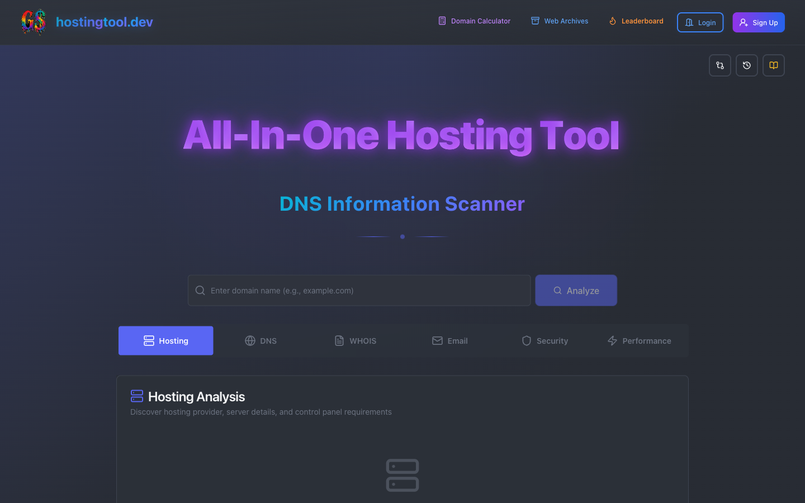
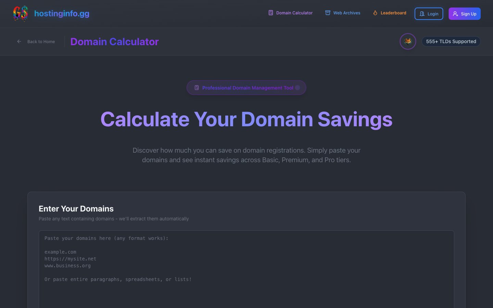
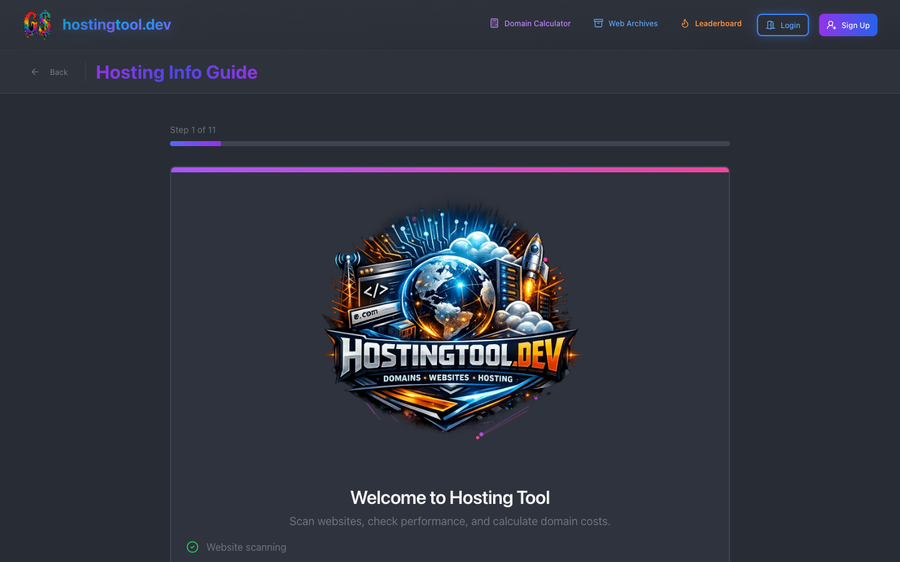
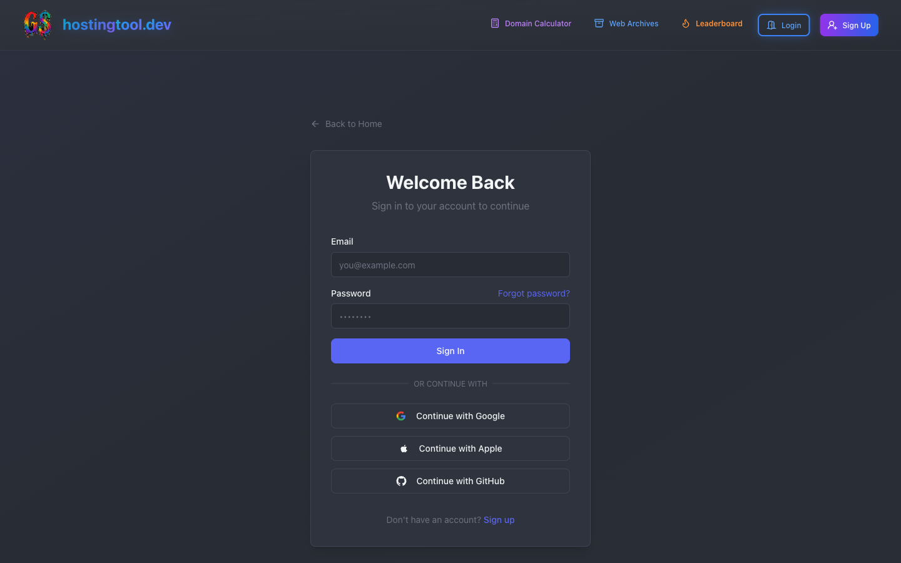

<div align="center">


<br>

<a href="https://hostinginfo.gg"></a>
&nbsp;
<a href="#intelligence-engine"></a>
&nbsp;
<a href="#architecture"></a>

<br>
<br>

<p>
  
</p>

<a href="https://github.com/prettycolor/hostinginfo.gg/actions"></a>
&nbsp;
<a href="#"></a>
&nbsp;
<a href="#intelligence-engine"></a>
&nbsp;
<a href="#"></a>
&nbsp;
<a href="https://opensource.org/licenses/MIT"></a>

<br>

---

<br>

Point it at a domain. It pulls back the full picture: hosting provider, CDN, WAF,<br>TLS config, email auth (SPF/DKIM/DMARC), DNS records, and performance scores.<br>Same infrastructure layer that **Cloudflare** and **Akamai** sit on top of.

<br>

> Domain reconnaissance for the infrastructure layer.

<br>

</div>

---

## What It Scans

| | Capability | What It Analyzes |
|:---:|-----------|-----------------|
| › | **SSL/TLS** | Cert chain, cipher suites, expiry dates, grade |
| › | **DNS** | A, AAAA, MX, TXT, CNAME, NS + propagation checks |
| › | **Email Auth** | SPF, DKIM, DMARC pass/fail with per-record scoring |
| › | **WAF/CDN** | Fingerprints the WAF vendor and CDN from response headers |
| › | **Performance** | PageSpeed (mobile + desktop), LCP, FID, CLS, TTFB |
| › | **Infrastructure** | ASN lookup, hosting provider, tech stack detection |
| › | **WHOIS/RDAP** | Registrar, registration date, expiry |
| › | **Threat Intel** | Google Safe Browsing check for malware/phishing flags |
| › | **Monitoring** | Scheduled scans, email alerts, monthly PDF reports |

---

## Screenshots

| Home | Domain Calculator |
|:----:|:-----------------:|
|  |  |

| Interactive Guide | Login (5 OAuth Providers) |
|:-----------------:|:-------------------------:|
|  |  |

---

## Intelligence Engine

Runs DNS, TLS, WHOIS, ASN, and HTTP probes in parallel, then combines the results into a single confidence-weighted security score.

```
                    ┌─────────────────────┐
                    │    Domain Input      │
                    └─────────┬───────────┘
                              │
         ┌────────────────────┼────────────────────┐
         │                    │                     │
┌────────▼──────┐   ┌───────▼────────┐   ┌───────▼────────┐
│  DNS Resolver  │   │  TLS Validator  │   │  WHOIS Parser  │
│  + MX/SPF/DKIM │   │  + Chain Audit  │   │  + RDAP Client │
└────────┬──────┘   └───────┬────────┘   └───────┬────────┘
         │                    │                     │
┌────────▼──────┐   ┌───────▼────────┐   ┌───────▼────────┐
│  ASN Detector  │   │ WAF Fingerprint│   │  Infra Attrib. │
│  + IP→Network  │   │ + CDN Headers  │   │  + Tech Stack  │
└────────┬──────┘   └───────┬────────┘   └───────┬────────┘
         │                    │                     │
         └────────────────────┼────────────────────┘
                              │
                    ┌─────────▼───────────┐
                    │   Evidence Fusion    │
                    │  Confidence Scoring  │
                    └─────────┬───────────┘
                              │
                    ┌─────────▼───────────┐
                    │  Security Posture    │
                    │  Composite Score     │
                    └─────────────────────┘
```

| Module | File | Purpose |
|--------|------|---------|
| **ASN Detector** | `asn-detector.ts` | IP-to-ASN resolution via RIR data |
| **WHOIS Parser** | `whois/` | Raw WHOIS protocol client + response parser |
| **TLS Analyzer** | `tls-certificate.ts` | Cert chain walk, cipher check, expiry tracking |
| **Infra Attribution** | `infrastructure-attribution.ts` | Matches headers/IPs to hosting and CDN vendors |
| **Firewall Intel** | `firewall-intelligence.ts` | WAF detection from response headers |
| **Evidence Fusion** | `evidence-fusion.ts` | Merges signals from all probes, weighted by confidence |
| **Security Scorer** | `security-posture-scoring.ts` | Single score from SSL + DNS + email + headers + threat data |
| **Confidence Engine** | `confidence-scorer.ts` | Weights each signal by source reliability |
| **Ownership Correlation** | `ownership-correlation.ts` | Links WHOIS, DNS, and infra data to the same entity |
| **SSRF Protection** | `ssrf-protection.ts` | Blocks internal network requests during scans |
| **Safe Browsing** | `safe-browsing.ts` | Google Safe Browsing API for malware/phishing flags |

---

## Architecture

```
┌───────────────────────────────────────────────────────┐
│                     Client Layer                      │
│                                                       │
│  React 19  ·  TypeScript  ·  Vite 6  ·  Tailwind CSS │
│  Radix UI  ·  Three.js  ·  Recharts  ·  Framer Motion│
│                     37 pages                          │
├───────────────────────────────────────────────────────┤
│                      API Layer                        │
│                                                       │
│  Express 5  ·  25 route groups  ·  Rate limiting      │
│  SSRF protection  ·  CORS  ·  Helmet security headers │
├───────────────────────────────────────────────────────┤
│                 Intelligence Engine                   │
│                                                       │
│  39 server libraries  ·  Custom protocol parsers      │
│  Evidence fusion  ·  Confidence scoring               │
├───────────────────────────────────────────────────────┤
│                 Authentication Layer                  │
│                                                       │
│  JWT  ·  Passport.js  ·  5 OAuth providers            │
│  Google  ·  GitHub  ·  Apple  ·  Microsoft  ·  Email  │
├───────────────────────────────────────────────────────┤
│                      Data Layer                       │
│                                                       │
│  MySQL 8 (Drizzle ORM)  ·  Redis (ioredis)           │
│  Cron-based scans  ·  Email alerts (Nodemailer)       │
└───────────────────────────────────────────────────────┘
```

---

## Features

<table>
<tr>
<td width="50%" valign="top">

### → Security Analysis
- SSL/TLS certificate validation with chain analysis
- Email auth (SPF, DKIM, DMARC) compliance grading
- Security headers (CSP, HSTS, X-Frame-Options)
- Google Safe Browsing malware detection
- WAF and CDN provider identification

</td>
<td width="50%" valign="top">

### → Performance Monitoring
- Google PageSpeed (mobile + desktop)
- Core Web Vitals tracking (LCP, FID, CLS)
- Historical trends with visual charts
- TTFB and resource breakdown analysis

</td>
</tr>
<tr>
<td width="50%" valign="top">

### → User Platform
- JWT auth with 5-provider OAuth (Google, GitHub, Apple, Microsoft, email)
- Email verification and password reset flows
- Domain claiming via DNS TXT records
- Scan history with filtering (7/30/90 days)

</td>
<td width="50%" valign="top">

### → Gamification System
- XP economy with scan-based rewards
- 50-level progression with tier-based avatars
- 5 rarity tiers (Common → Legendary) across 76 avatar images
- Leaderboard with 3D chaos emerald ranking
- Achievement system with unlock notifications

</td>
</tr>
</table>

---

## Tech Stack

| Layer | Technology | Version |
|-------|-----------|---------|
| **Frontend** | React, TypeScript, Vite, Tailwind CSS | 19, 5.7, 6.4, 3.4 |
| **UI** | Radix UI, Lucide, Framer Motion, GSAP | Latest |
| **3D** | Three.js, React Three Fiber, Drei | 0.182 |
| **Charts** | Recharts | 3.6 |
| **Backend** | Express, Node.js | 5.1, 22+ |
| **Database** | MySQL 8, Drizzle ORM | 8.0, 0.44 |
| **Cache** | Redis, ioredis | 7+, 5.9 |
| **Auth** | JWT, Passport.js, bcryptjs | — |
| **Email** | Nodemailer | 7.0 |
| **CI** | GitHub Actions | — |

---

## Quick Start

```bash
# Clone
git clone https://github.com/prettycolor/hostinginfo.gg.git
cd hostinginfo.gg

# Install
npm install

# Database (MySQL + Redis via Docker)
docker compose -f docker-compose.local.yml up -d

# Configure
cp env.example .env
# Edit .env with your JWT secret and email credentials

# Migrate
npm run db:migrate

# Run
npm run dev
```

> Runs on `http://localhost:20000`

---

## Project Structure

```
src/
├── pages/              37 page components
├── components/         41 React components + UI primitives
├── lib/                Client utilities, state, API clients
├── layouts/            Dashboard, Website, Root layouts
├── hooks/              GPU detection, progressive retry, reduced motion
├── contexts/           Filter, Toast providers
├── server/
│   ├── api/            25 Express route groups
│   ├── lib/            39 intelligence engine libraries
│   ├── db/             Drizzle schema (2,000+ lines) + client
│   ├── cron/           Automated monitoring jobs
│   └── middleware/     Security headers, rate limiting
drizzle/                30 migration files
scripts/                Build, lint, and CI tooling
```

---

## Related Projects

| | Project | Description |
|:---:|---------|-------------|
| › | **[cortex](https://github.com/prettycolor/cortex)** | Self-paced learning platform — Network+, AWS, Cloudflare SE prep with interactive diagrams and spaced repetition |
| › | **[aegis](https://github.com/prettycolor/aegis)** | AI agent infrastructure framework — orchestration, trust scoring, circuit breakers, RAG pipelines |
| › | **[atelier](https://github.com/prettycolor/atelier)** | Design asset management gallery — token pipelines, component galleries, brand organization |

---

## License

MIT

---

<div align="center">

<br>

Built by the hostinginfo.gg contributors

*Domain reconnaissance for the infrastructure layer.*

<a href="https://hostinginfo.gg">hostinginfo.gg</a>

</div>
